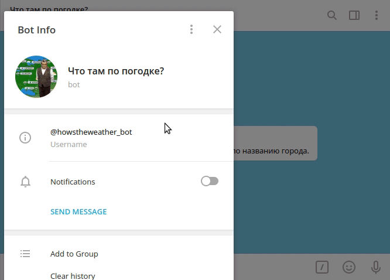

# how's the weather? bot
Тестовое задание для "Школы будущих СТО" Яндекс.Облака.

**Задача**: Сервис умного прогноза погоды. **Уровень сложности**: со звездочкой.

**Использованные технологии и сервисы**: Golang — язык разработки сервиса, tgbotapi — клиентская библиотека к Telegram
Bot API. Клиентская библиотека к OpenWeatherMap (а вернее, ее фрагмент) был написан самостоятельно, поскольку в 
доступных open-source решениях не было поддержки необходимого для решения задачи `OneCall API` (только этот cервис 
OpenWeatherMap предоставляет прогноз погоды, а не только текущую погоду для бесплатной подписки). 

**Пользовательский интерфейс** представлен чат-ботом в Telegram @howstheweather_bot. Взаимодействие с ботом происходит 
следующим образом: пользователь пишет боту название города, бот возвращает прогноз погоды на текущий день и общую 
рекомендацию по одежде. Ответ имеет следующий формат: 
```
Прогноз погоды: %общий прогноз погоды%. Утром ожидается %f градусов по Цельсию, ощущается как %f. 
Днем будет %f градусов по Цельсию, по ощущениям как %f. Вечером ожидается %f, по ощущениям как %f, и, 
наконец, ночью %f и %f соответственно. Скорость ветра: %f метра в секунду. 
Влажность воздуха: %d процентов. UV индекс: %f. 
Рекомендуем %рекомендация%.
```

**Работа программы**. 
Данные (название города) поступают в программу через интерфейс чат-бота Telegram. Для конкретного
города происходит запрос к API OpenWeatherMap для определения координат этого города. Затем происходит повторный запрос 
к API OpenWeatherMap для получения прогноза погоды. На основе полученных данных составляется краткий репорт с общей 
информацией по погоде и определяется рекомендация по одежде, которые затем через Telegram API отправляются пользователю.

**Инструкция по запуску**. Для самостоятельного запуска бота необходимо зарегистрировать нового бота у @BotFather и 
получить токен. Также необходимо зарегистрироваться на сайте OpenWeatherMap и получить токен для пользования API. 

Эти данные предоставляются программе как переменные окружения под названиями `TELEGRAM_API_TOKEN` и 
`OPENWEATHERMAP_API_TOKEN` соответственно. Затем программу необходимо запустить (возможно, для корректной работы придется 
использовать средства обхода блокировок, например VPN или прокси-сервера). После этого ботом можно пользоваться. 

